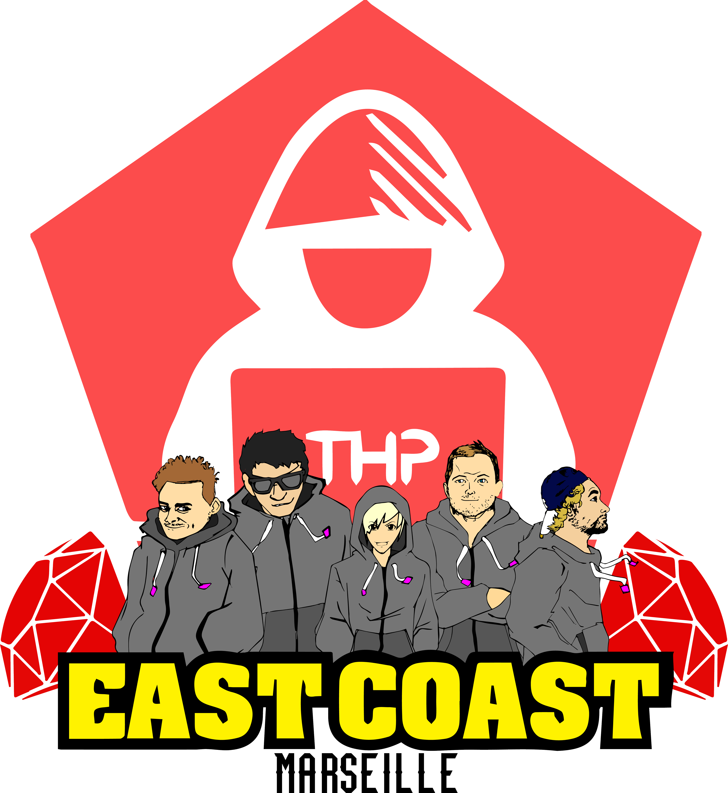

# EXERCICE SEMAINE 3 - JOUR 3

-------------

### Introduction : Présentation de l'équipe
- Raouf (@raouf)
- Manu (@tinoun)
- Youcef (@youcef)
- Berangere (@ekkhi)

-------------

### Utilisation du bundle

Tout d'abord, clone ce projet dans ton dossier.
Ouvre ton Terminal, et place toi dans le dossier cloné.

Tape : `bundle install` dans ton Terminal.
Cela te permettra d'installer les gems necessaires à l'execution du programme.

Si tu as un message d'erreur, essaie `rvm install 2.5.1`.
ou encore `gem update`

------------

### Arborescence du projet

Dossier *database*
Il contient le fichier townhalls.csv, il regroupe 

------------

### Utilisation du programme

En premier lieu renseignes ton config.json dans le dossier scrapper.
Ensuite lance le programme townhalls_scrapper.rb , il va recuperer les données utiles et les intégrer à la feuille de calcul : [ici](https://docs.google.com/spreadsheets/d/1cMn78fjMDMmt8BIENpq0sjPeNASopj50wwUKSXDqs5s/edit#gid=0).

------------

### Description du programme

*Dossier Scrapper*

------------

Merci pour la correction ! 

